# 派生类能够继承基类中的哪些内容？

## 1. 构造函数

无论基类的构造函数是私有的（在定义时使用修饰符 ```private```）还是公有的（在定义时使用修饰符 ```public```），派生类都不能继承基类的构造函数.

### 假设基类可以继承父类的构造函数

如果我们有一个类:

```java
public class Parent {
    String dataInParent;
    
    public Parent() {}
    public Parent(String dataInParent) {
        this.dataInParent = dataInParent;
    }
}
```

并且存在另一个继承了 ```Parent``` 类的派生类:

```java
public class Child extends Parent {
    String dataInChild;
    
    public Child() {}
    public Child(String dataInChild) {
        this.dataInChild = dataInChild;
    }
}
```

如果派生类 ```Child``` 能够继承基类 ```Parent``` 的构造函数，那么这等价于:

```java
public class Child extends Parent {
    String dataInChild;

    public Parent() {}
    public Parent(String dataInParent) {
        this.dataInParent = dataInParent;
    }
    
    public Child() {}
    public Child(String dataInChild) {
        this.dataInChild = dataInChild;
    }
}
```

然而根据构造函数的定义，一个类的构造函数的名字必须与类名相同，而这时 ```Child``` 类中出现了函数名为 ```Parent``` 的构造函数，因此这时非法的.

从而基类不能继承父类的构造函数.

## 2. 成员变量

无论基类中的成员变量是私有的（变量在定义时使用修饰符 ```private```）还是公有的（变量在定义时使用修饰符 ```public```），派生类都能够继承基类的成员变量.

### 2.1 基类的成员变量是公有的

如果我们有一个类，其中存在一个公有的成员变量:

```java
public class Parent {
    String dataInParent;
    
    public Parent() {}
    public Parent(String dataInParent) {
        this.dataInParent = dataInParent;
    }
}
```

并且存在另一个类继承了 ```Parent``` 类:

```java
public class Child extends Parent{
    String dataInChild;
    
    public Child() {}
    public Child(String dataInChild) {
        this.dataInChild = dataInChild;
    }
}
```

那么派生类 ```Child``` 的成员方法可以直接访问基类的公共属性 ```dataInParent```:

```java
public class Child extends Parent{
    String dataInChild;
    
    public Child() {}
    public Child(String dataInChild) {
        this.dataInChild = dataInChild;
    }
    
    public void displayDataInParent() {
        System.out.println(dataInParent);
    }
}
```

### 2.2 基类的成员变量是私有的

如果我们有一个类，其中存在一个私有的成员变量及其对应的 ```setter``` 和 ```getter``` 方法:

```java
public class Parent {
    private String dataInParent;
    
    public Parent() {}
    public Parent(String dataInParent) {
        this.dataInParent = dataInParent;
    }
    
    public void setDataInParent(String dataInParent) {
        this.dataInParent = dataInParent;
    }
    
    public String getDataInParent() {
        return dataInParent;
    }
}
```

并且存在另外一类继承了 ```Parent``` 类:

```java
public class Child extends Parent{
    String dataInChild;
    
    public Child() {}
    public Child(String dataInChild) {
        this.dataInChild = dataInChild;
    }
}
```

那么派生类 ```Child``` 不能直接访问 ```Parent``` 类的私有属性 ```dataInParent```，但是可以通过该属性的 ```getter``` 方法（```getDataInParent``` 方法）和该属性的 ```setter``` 方法（```setDataInParent``` 方法）间接地访问该私有属性:

```java
public class Child extends Parent{
    String dataInChild;
    
    public Child() {}
    public Child(String dataInChild) {
        this.dataInChild = dataInChild;
    }
    
    public void changeDataInParent(String newDataInParent) {
        setDataInParent(newDataInParent);
    }
    
    public void displayDataInParent() {
        System.out.println(dataInParent);
    }
}
```

### 2.3 基类与派生类的内存图

如果存在 2 个类 ```Parent``` 类和 ```Child``` 类, 其中后者继承了前者:

```java
class Parent {
    String dataInParent;
}

class Child extends Parent {
    String dataInChild;
}
```

以及一个测试类:

```java
public class Test {
    public static void main(String[] args) {
        Child child = new Child();
        
        child.dataInChild = "data in child";
        child.dataInParent = "data in parent";
        
        System.out.println(child.dataInChild + child.dataInParent);
    }
}
```

那么当测试类的代码开始被执行时，虚拟机首先将测试类 ```Test``` 的字节码加载到 ```方法区``` 中，同时 ```main``` 方法的字节码也随之被加载到 ```方法区``` 中:

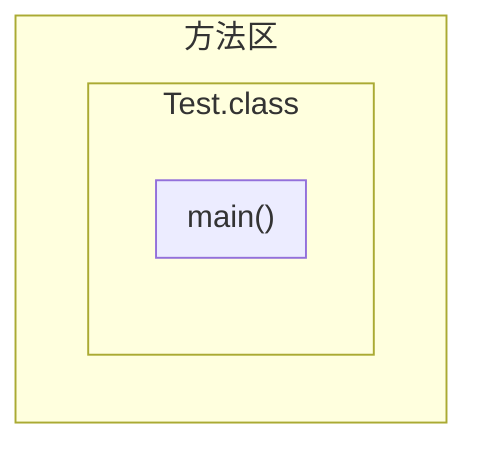

之后虚拟机将 ```main``` 方法的栈帧加载到 ```栈内存``` 中，用于保存 ```main``` 方法的局部变量:

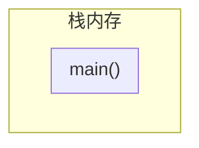

当虚拟机执行到语句 ```Child child = new Child()``` 时，这时类 ```Child``` 第一次被使用，虚拟机将它的字节码加载到方法区中:

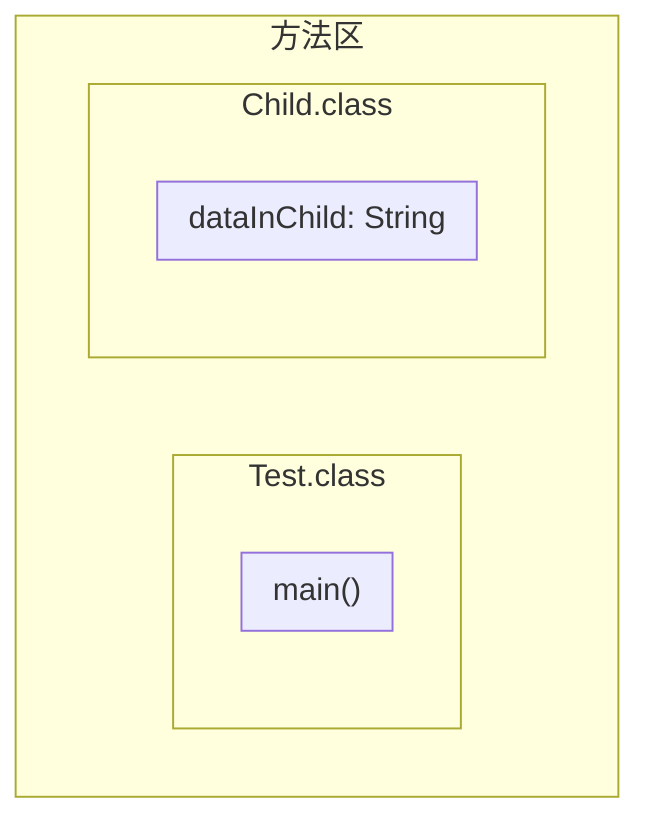

由于 ```Child``` 类继承了 ```Parent``` 类，同时这也是该类第一次被使用，因此虚拟机同时将 ```Parent``` 类的字节码加载到方法区中:

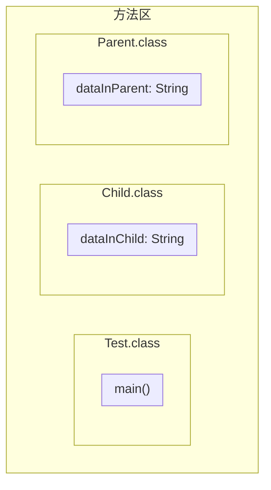
之后虚拟机继续执行语句 ```Child child = new Child()```. 这时虚拟机在 ```main``` 方法的栈帧中为变量 ```child``` 开辟一块内存空间，用于存储 ```Child``` 类对象的地址值:

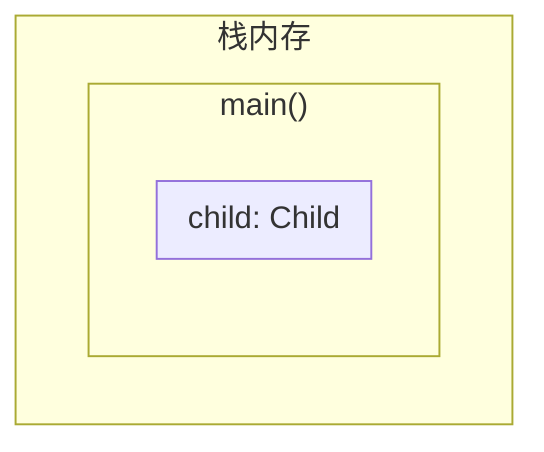

并且在堆内存中为 ```Child``` 对象分配一块空间，由于 ```Child``` 类继承了 ```Parent``` 类，因此分配得到的空间需要同时存储 ```Child``` 类和 ```Parent``` 类的成员变量:

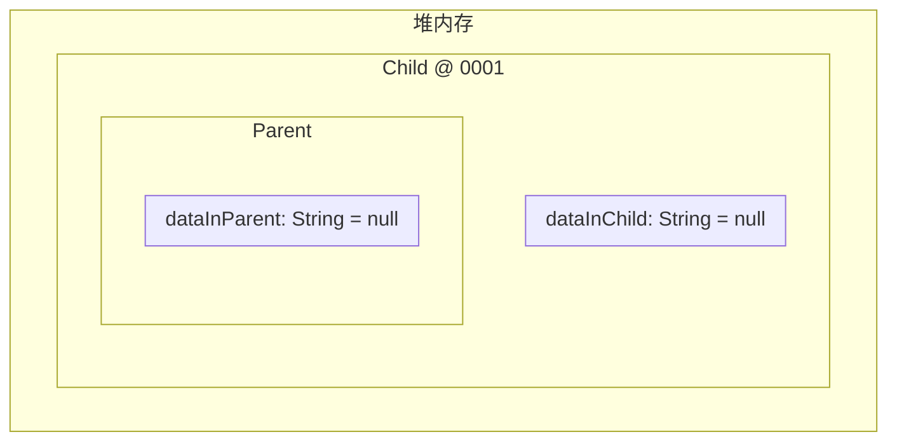

并且将所有的成员变量默认初始化为 ```null``` (因为它们都是引用数据类型). 假设堆内存中的 ```Child``` 对象的地址值为 ```0001```，那么虚拟机将该地址值填入 ```main``` 方法的栈帧中 ```child``` 变量的存储区域:

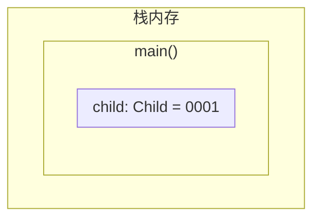

之后虚拟机开始执行语句 ```child.dataInChild = "data in child"```，由于其中赋值运算的右值是一个字符串字面量，那么虚拟机就会在串池（StringTable） 中查找与该字面量具有相同内容的 ```String``` 对象. 由于这时该字面量第一次出现，因此虚拟机在串池中新建了一个 ```String``` 对象:

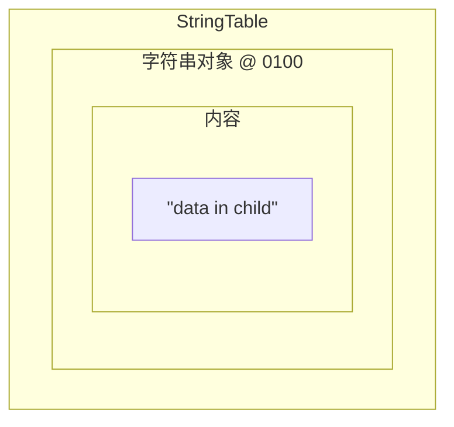

假设该对象在堆内存中的地址为 ```0100```，那么虚拟机在堆内存中 ```Child``` 对象中按照 ```派生类的属性``` &#x2192; ```基类的属性``` 搜索被赋值的变量 ```dataInChild```. 由于派生类 ```Child``` 中存在变量 ```dataInChild```，因此虚拟机将地址值 ```0100``` 赋值给它:

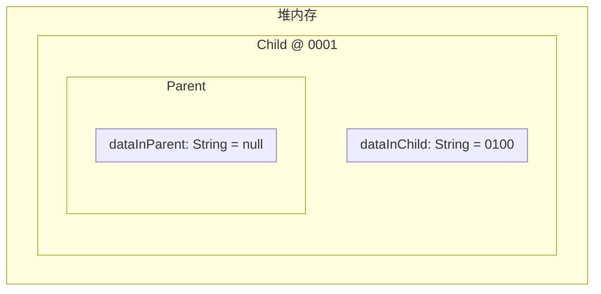

之后虚拟机开始执行语句 ```child.dataInParent = "data in parent"```，同理，该字符串字面量时第一次出现，因此虚拟机在串池中新建一个新的 ```String``` 对象，用于存储该字面量的内容:

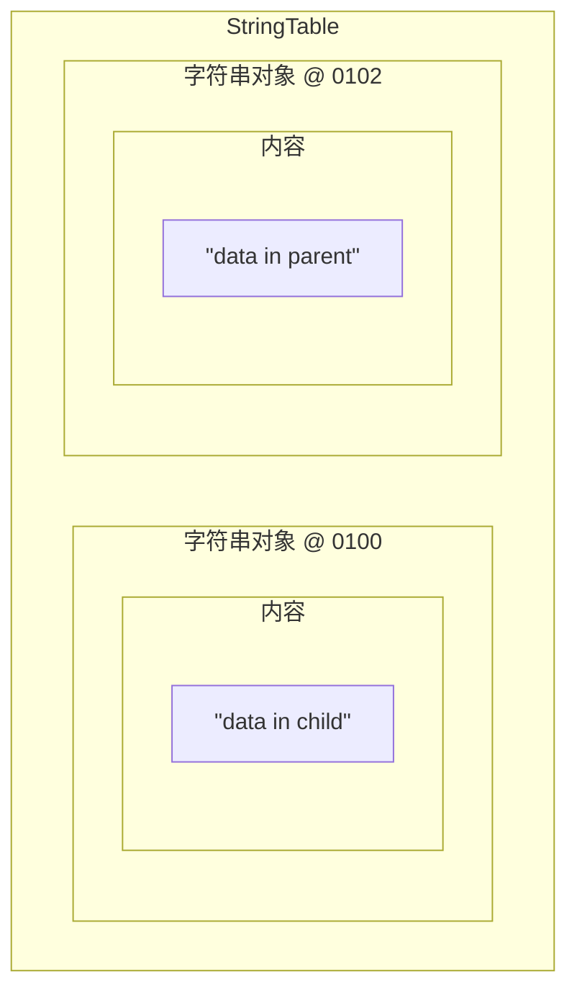

假设该 ```String``` 对象在堆内存中的地址值为 ```0102```. 这时被赋值的变量为 ```dataInParent```，虚拟机首先在派生类的属性中搜索该变量，由于 ```dataInParent``` 不是 ```Child``` 类的属性，因此虚拟机在它的基类 ```Parent``` 中搜索该属性，寻找到成员变量 ```dataInParent``` 后，将地址值 ```0102``` 赋值给它:

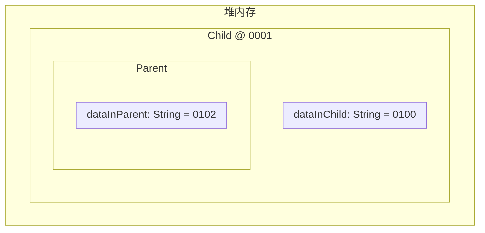

最后虚拟机执行语句 ```System.out.println(child.dataInChild + child.dataInParent)```.

#### 2.4 基类的成员变量是私有的

如果我们将 ```Parent``` 类的成员变量改为私有，并且保持它的派生类 ```Child``` 不变:

```java
class Parent {
    private String dataInParent;
}

class Child extends Parent {
    String dataInChild;
}
```

那么当虚拟机再次执行到语句 ```child.dataInParent = "data in parent"``` 时，这时的堆内存中的情况为:


由于派生类 ```Child``` 中不存在属性 ```dataInParent```，因此虚拟机在 ```Child``` 类的基类 ```Parent``` 的属性中搜索，由于 ```Parent``` 类的属性 ```dataInParent``` 被 ```private``` 修饰，因此指向 ```Child``` 对象的变量 ```child``` 没有访问该属性的权限，从而虚拟机会报错.

虽然派生类的对象无法直接访问它的基类的成员变量，但是在堆内存中，**派生类的对象的存储空间有一部分用于存储它的基类的成员变量**. 因此无论基类中的属性是否是私有的，派生类都会将它继承下来（在对象的内存空间中存在基类的属性）.


## 3. 成员方法

一个类的没有被修饰符 ```private```，```static``` 和 ```final``` 修饰的方法被称为虚方法，每个类都有一个虚方法表，其中包含该类本身的虚方法，以及它的直接基类和所有间接基类的虚方法.

假设有 3 个类 ```A```，```B``` 和 ```C```，它们之间的关系为，```A``` 继承 ```B```，```B``` 继承 ```C```. 并且 ```A``` 类具有成员方法 ```a()```, ```B``` 类具有成员方法 ```b()```，而 ```C``` 类具有成员方法 ```c()```. 并且这些成员方法都是虚方法.

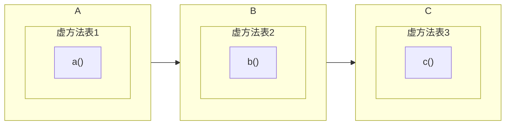

虚拟机从最顶层的基类开始，将虚方法表逐层向下合并. 由于 ```B``` 类继承 ```C``` 类，因此虚拟机将 ```C``` 类的虚方法添加到 ```B``` 类的虚方法表中:

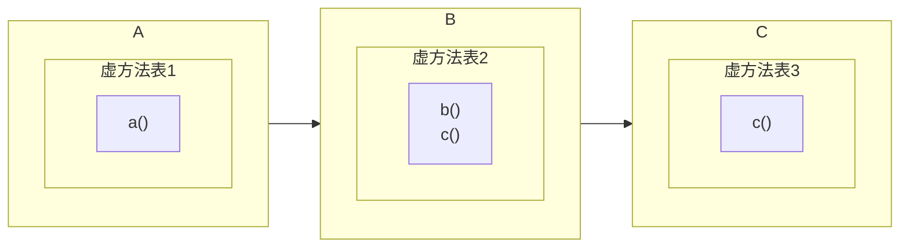

同理，由于 ```A``` 类继承 ```B``` 类，因此 ```B``` 类的虚方法表中的方法会被添加到 ```A``` 类的虚方法表中:

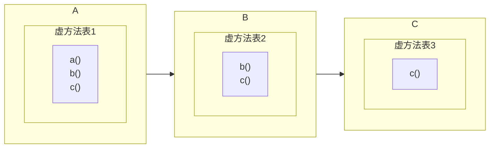

**如果派生类的虚方法表中存在基类的虚方法，那么我们称该派生类继承了基类的该虚方法**. 

因此对于 ```A``` 类，它的虚方法表中存在 ```B``` 类和 ```C``` 类的虚方法，因此它继承了 ```B``` 类的成员方法 ```b()``` 和 ```C``` 类的成员方法 ```c()```. 当我们通过 ```A``` 类的对象调用方法 ```b()``` 或 ```c()``` 时，虚拟机会直接在 ```A``` 类的虚方法表中寻找对应的方法.

### 3.1 基类与派生类的成员方法的内存图

如果存在 2 个类 ```Parent``` 和 ```Child```，其中后者继承了前者，它们的定于如下:

```java
class Parent {
    public void displayInParent1() {
        System.out.println("display in parent 1");
    }

    private void displayInParent2() {
        System.out.println("display in parent 2");
    }
}

class Child extends Parent {
    public void displayInChild() {
        System.out.println("display in child");
    }
}
```
并且存在一个对应于 ```Parent``` 类和 ```Child``` 类的测试类:

```java
public class Test {
    public static void main(String[] args) {
        Child child = new Child();
        
        child.displayInChild();
        child.displayInParent1();
        child.displayInParent2();
    }
}
```

当虚拟机将 ```Test``` 类以及其中的 ```main``` 方法的字节码加载到方法区后:

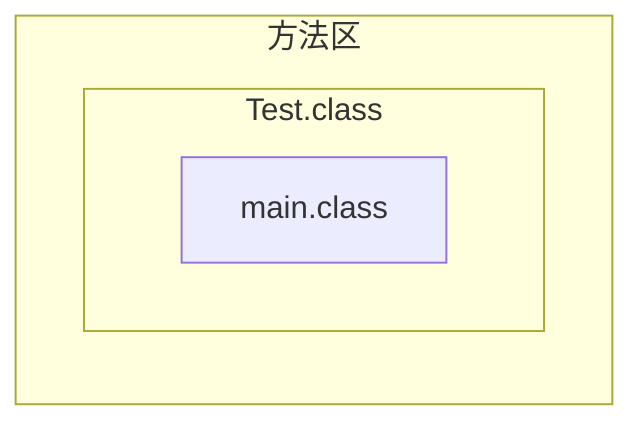

虚拟机将 ```main``` 方法的栈帧加载到栈内存中，并开始执行 ```main``` 方法的语句. 当虚拟机执行到语句 ```Child child = new Child()``` 后，虚拟机将 ```Child``` 类的字节码加载到方法区中:

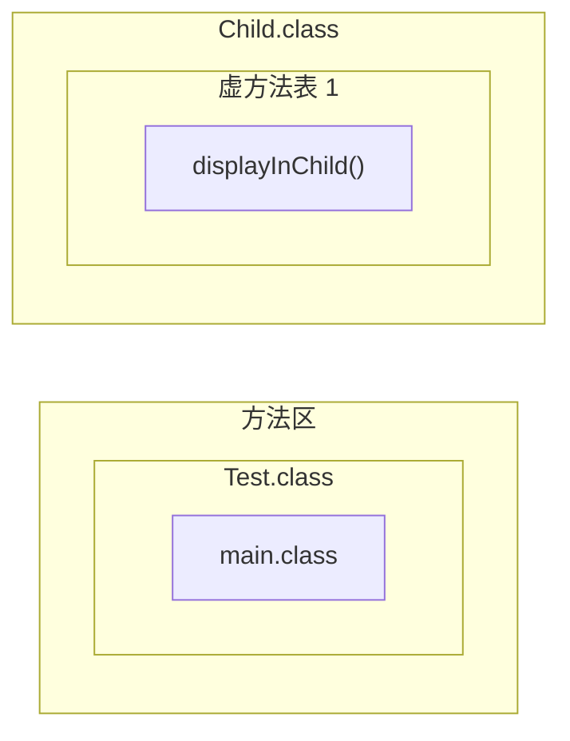

由于 ```Child``` 类继承了 ```Parent``` 类，因此虚拟机将 ```Parent``` 类的字节码加载到方法区中:

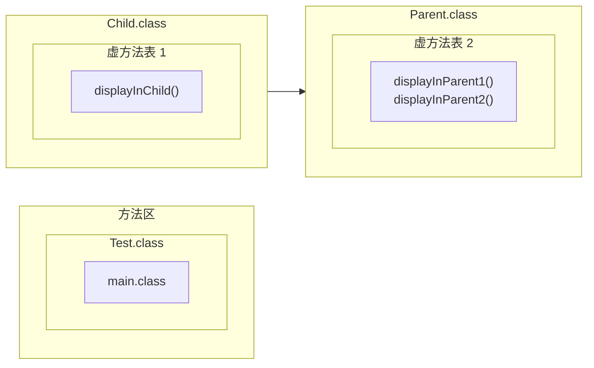

```Parent``` 类在定义时没有显式地继承任何类，因此它默认继承 ```Object``` 类:

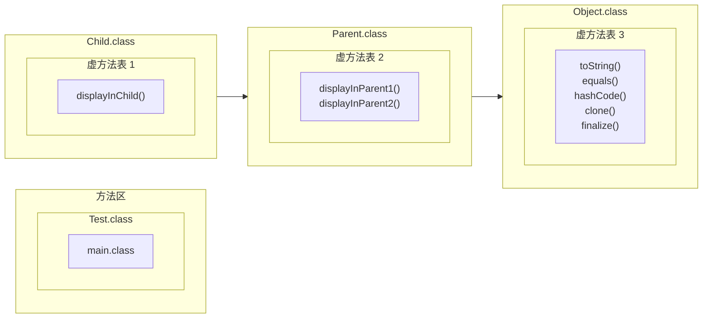

其中 ```Object``` 类的虚方法有 ```toString()```，```equals()```，```hashCode()```，```clone()``` 和 ```finalize()```. 虚拟机从继承关系的顶层基类（即 ```Object``` 类开始）将基类的虚方法表与它的派生类的虚方法表进行合并.

虚拟机将 ```Object``` 类的所有虚方法添加到 ```Parent``` 类的虚方法表中:

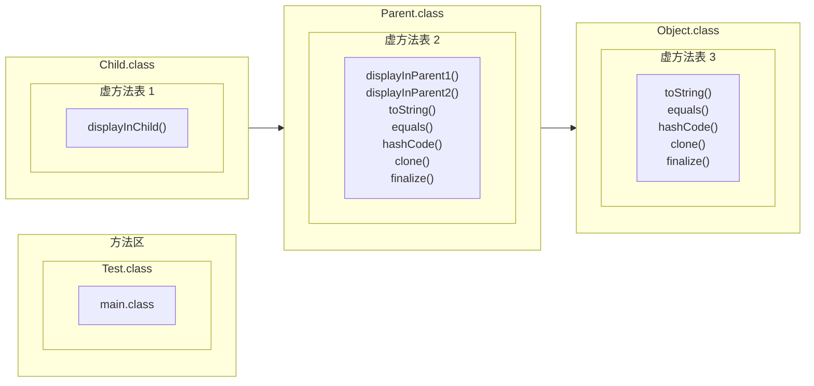

同理，虚拟机再将 ```Parent``` 的虚方法表中的所有虚方法添加到 ```Child``` 类的虚方法表中:

```mermaid
graph LR
    subgraph "方法区"
        subgraph "Test.class"
            id1["main.class"]
        end
    end

    subgraph A["Child.class"]
        subgraph "虚方法表 1"
            id2["displayInChild() <br/> displayInParent1() <br/> displayInParent2() <br/> toString() <br/> equals() <br/> hashCode() <br/> clone() <br/> finalize()"]
        end
    end
    
    subgraph B["Parent.class"]
        subgraph "虚方法表 2" 
            id3["displayInParent1() <br/> displayInParent2() <br/> toString() <br/> equals() <br/> hashCode() <br/> clone() <br/> finalize()"]
        end
    end
    
    subgraph C["Object.class"]
        subgraph "虚方法表 3" 
            id4["toString() <br/> equals() <br/> hashCode() <br/> clone() <br/> finalize()"]
        end
    end
    
    A --> B --> C
```

当通过 ```Child``` 类的对象（或者指向它的变量）调用 ```Child``` 类的成员方法或者它从基类继承而来的成员方法时，虚拟机会首先在 ```Child``` 类的虚方法表中进行查找. 因此当虚拟机执行语句 ```child.displayInChild()``` 和 ```child.displayInParent1()``` 时，实际上是调用 ```Child``` 类的虚方法表中对应项指向的方法.

当虚拟机执行语句 ```child.displayInParent2``` 时，由于 ```Child``` 类的虚方法表中不存在该方法对应的项，因此虚拟机会沿着 ```Child``` &#x2192; ```Parent``` &#x2192; ```Object``` 的继承关系，搜索每个类的成员方法，尝试找到方法 ```displayInParent2```. 最终虚拟机会在 ```Parent``` 类中找到该成员方法，但是它是私有的，因此变量 ```child``` 没有访问它的权限，从而虚拟机会报错. 