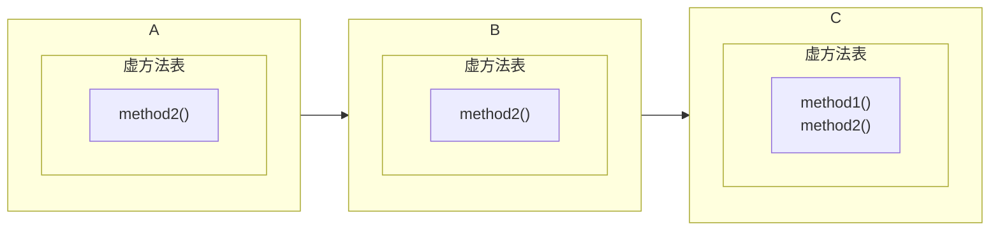
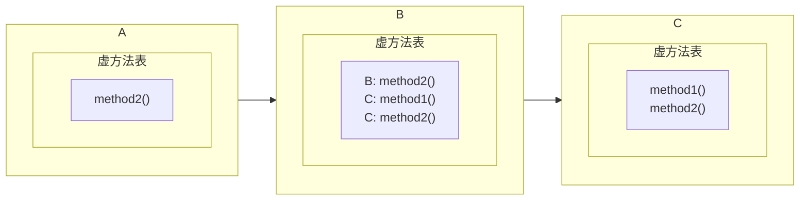
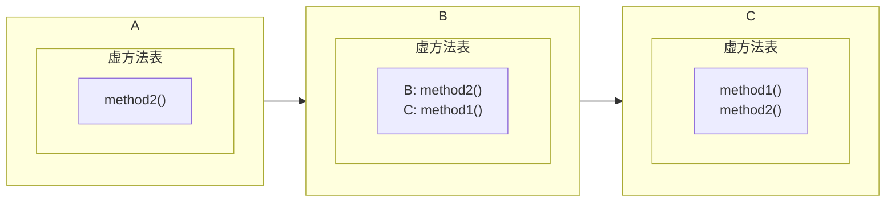
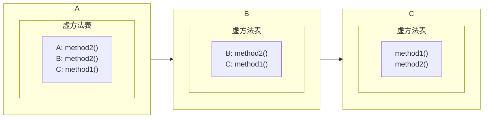
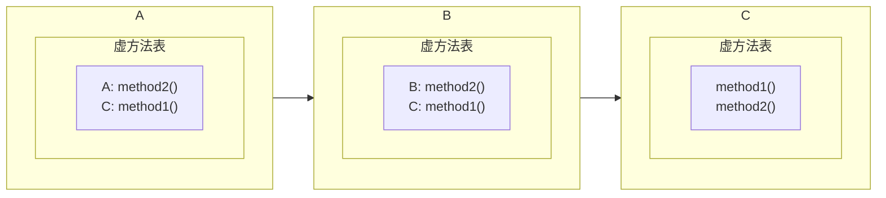

# 继承中成员方法的访问特点

在类的成员方法中调用另一个成员方法时（不通过关键字 ```this``` 和 ```super```），那么虚拟机首先会在该类的类体中寻找被调用方法的定义，如果没有找到，那么虚拟机会沿着该类的继承关系，在它的基类中寻找被调用方法的定义.

如果我们有 2 个类 ```Parent``` 和 ```Child```，其中后者继承前者，它们的定义分别为:

```java
class Parent {
    public void display() {
        System.out.println("display in base class");
    }
}

class Child extends Parent {
    public void display() {
        System.out.println("display in derived class");
    }
    
    public void present() {
        this.display();
        super.display();
    }
}
```

并且我们有一个对应于 ```Parent``` 类和 ```Child``` 类的测试类:

```java
public class Test {
    public static void main(String[] args) {
        Child child = new Child();
        
        child.present();
    }
}
```

```Child``` 类的成员方法 ```present``` 的方法体中的语句 ```this.display()``` 中的 ```this``` 关键字指定了虚拟机在搜索 ```display``` 方法的定义时，搜索的起点为 ```present``` 方法所处的当前类 ```Child```.

因此当虚拟机执行到语句 ```this.display()``` 时，虚拟机会首先在 ```Child``` 类的类体中搜索 ```display``` 方法的定义，当虚拟机发现 ```Child``` 类存在成员方法 ```display``` 时，它会直接调用该方法.

同理， ```present``` 方法中的语句 ```super.display()``` 指定了虚拟机在搜索 ```display``` 方法的定义时，搜索的起点为 ```Child``` 类的直接基类（这里是 ```Parent``` 类）.

因此当虚拟机执行语句 ```super.display()``` 时，它会沿着 ```Child``` 类的继承关系，在该类的基类中搜索 ```display``` 方法的定义. 当虚拟机发现 ```Parent``` 类存在成员方法 ```display``` 时，它会直接调用该方法.

因此 ```Test``` 类的 ```main``` 方法的语句 ```child.present()``` 被执行后，控制台的输出结果为:

```text
display in derived class
display in base class
```

# 1. 方法的重写

如果派生类中存在一个方法 ```method1```，并且在基类中存在一个方法 ```method2```，如果 ```method1``` 与 ```method2``` 之间满足以下的关系:

1. ```method1``` 与 ```method2``` 具有相同的方法名.
2. ```method1``` 与 ```method2``` 具有相同的参数列表.
3. ```method1``` 的访问权限大于等于 ```method2``` 的访问权限.
    > 没有任何访问权限修饰符（```private```，```protected``` 和 ```public```）的方法的访问权限最低. 被修饰符 ```public``` 修饰的方法的访问权限最高. 被修饰符 ```protected``` 修饰的方法的访问权限介于这两者之间.
4. ```method1``` 的返回值类型 ```T1``` 要么与 ```method2``` 的返回值类型 ```T2``` 相同，要么:
   1.  ```T1``` 能够被隐式地提升为 ```T2```（```T1``` 和 ```T2``` 都是基础数据类型）.
   2.  ```T1``` 是 ```T2``` 的直接或间接派生类（```T1``` 和 ```T2``` 都是引用数据类型）.
5. ```method2``` 必须能够被添加到类的虚方法表中.
    > 即该方法在定义时不能被修饰符 ```private```，```static``` 和 ```final``` 修饰.

## 1.2 虚方法表

在 ```Java``` 中，派生类对基类方法的重写是通过虚方法表完成的. 假设我们有 3 个类，```A```，```B``` 和 ```C```，它们之间的继承关系为，```A``` 继承 ```B```，```B``` 继承 ```C```:



其中 ```C``` 类的两个成员方法 ```method1``` 和 ```method2``` 都是虚方法. ```B``` 类的成员方法 ```method2``` 也是虚方法，它的 ```方法名```，```参数列表``` 和 ```返回值类型``` 与 ```C``` 类的方法 ```method2``` 相同. 并且 ```A```  类的成员方法也是虚方法，同时它的 ```方法名```，```参数列表``` 和 ```返回值类型``` 与 ```B``` 类的方法 ```method2``` 相同.

由于 ```B``` 类继承 ```C``` 类，因此虚拟机会将 ```C``` 类的虚方法表中的项添加到 ```B``` 类的虚方法中:



根据方法的重写规则，```B``` 类的方法 ```method2``` 能够重写 ```C``` 类的方法 ```method2```，因此在 ```B``` 类的虚方法表中，```C``` 类的方法 ```method2``` 的项会被 ```B``` 类的方法 ```method2``` 的项替换:



同理，由于 ```A``` 类继承 ```B``` 类，因此虚拟机会将 ```B``` 类的虚方法表中的项添加到 ```A``` 类的虚方法表中:



同理，根据方法的重写规则，```A``` 类的方法 ```method2``` 能够重写 ```B``` 类的方法 ```method2```，因此在 ```A``` 类的虚方法表中，```B``` 类的方法 ```method2``` 的项会被 ```A``` 类的方法 ```method2``` 的项替换:



因此方法的重写，是通过**将派生类的方法在虚方法表中的项，覆盖它重写的基类的方法在同一个虚方法表中的项**而实现的.

## 1.2 ```@Override``` 注解

```@Override``` 注解添加在重写了基类的成员方法的派生类的方法的定义前，用于提示虚拟机这是一个重写后的方法:

```java
class Parent {
    public void display() {
        System.out.println("display in base class");
    }
}

class Child extends Parent {
    @Override
    public void display() {
        System.out.println("display in derived class");
    }
    
    public void present() {
        this.display();
        super.display();
    }
}
```