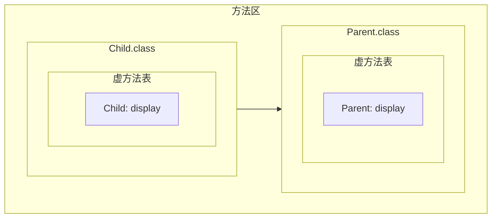
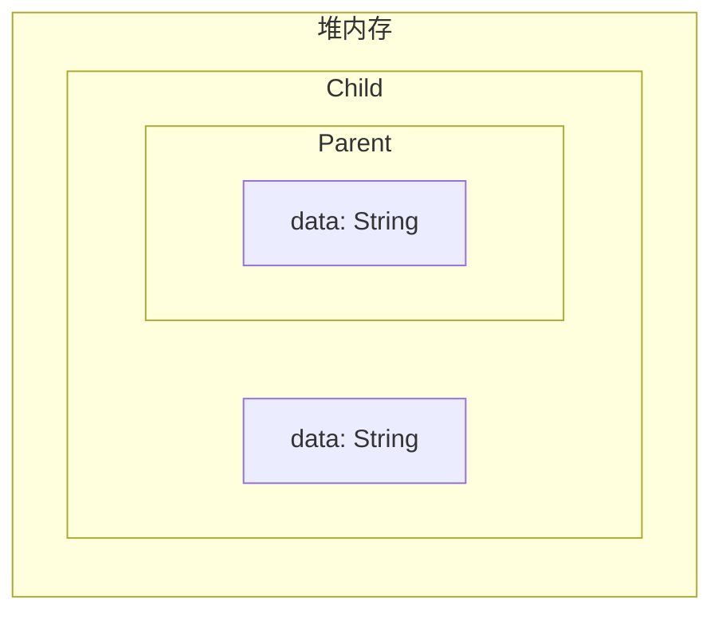
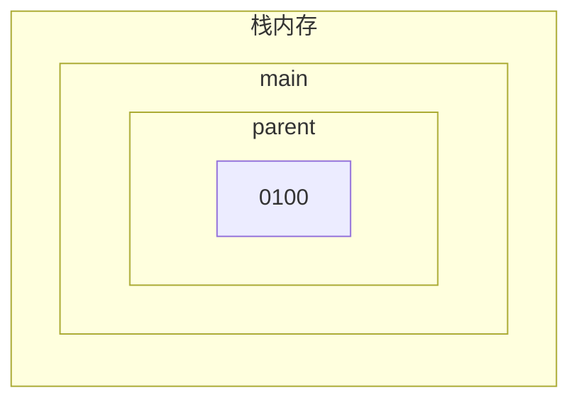

# 多态中调用成员变量和方法的特点

## 1. 派生类到基类的隐式类型转换

如果我们有两个类 ```Parent``` 和 ```Child```，其中后者继承前者，它们的定义为:

```java
class Parent {
    String data;
    
    public Parent() {}
    
    public Parent(String data) {
        this.data = data;
    }
    
    public void display() {
        System.out.println("display in parent");
    }
}

class Child extends Parent {
    String data;
    
    public Child() {}
    
    public Child(String data) {
        this.data = data;
    }
    
    @Override
    public void display() {
        System.out.println("display in child");
    }
}
```
我们在测试类的 ```main``` 方法中，可以通过 ```new``` 关键字创建一个 ```Child``` 类的对象，并且使用一个 ```Parent``` 类的变量指向这个对象:

```java
public class Test {
    public static void main(String[] args) {
        Parent parent = new Child();
    }
}
```

或者按标准的方式创建一个 ```Child``` 类的对象，并且使用一个 ```Child``` 类的变量指向它，再将该 ```Child``` 类的变量存储的地址值赋值给另一个 ```Parent``` 类的变量:

```java
public class Test {
    public static void main(String[] args) {
        Child child = new Child();
        
        Parent parent = child;
    }
}
```

即基类的变量可以安全地指向派生类的对象，或者**一个派生类类型的变量可以被安全地隐式转换为基类类型的变量**.

## 2. 通过指向派生类对象的基类变量调用基类的成员变量和方法

当虚拟机执行完 ```main``` 方法中的语句 ```Parent parent = new Child()``` 后:

```java
public class Test {
    public static void main(String[] args) {
        Parent parent = new Child();
    }
}
```

由于这时的 ```Child``` 类以及它的基类 ```Parent``` 是第一次被使用，因此虚拟机将它们的字节码加载到方法区中:



之后虚拟机在堆内存中创建 ```Child``` 对象，其中包含 ```Child``` 类的成员变量以及它的基类的所有成员变量:



假设该 ```Child``` 对象在堆内存中的地址为 ```0010```，那么虚拟机在栈内存的 ```main``` 方法的栈帧中为 ```Parent``` 类型的变量开辟空间，并且将地址值 ```0010``` 存储到该空间中:



我们可以通过变量 ```parent``` 访问 ```Parent``` 类的成员变量或者成员方法. 

由于变量 ```parent``` 指向的堆内存的对象是 ```Child``` 类型的，它的虚方法表的地址指向的是方法区中 ```Child``` 类的虚方法表，因为 ```Child``` 类的方法 ```display``` 重写了 ```Parent``` 类的方法 ```display``` ，从而 ```Child``` 类的虚方法表中与方法 ```display``` 相关的项实际上指向了 ```Child``` 类的成员方法 ```display``` 的地址.

因此通过变量 ```parent``` 调用方法 ```display```，实际上调用的是 ```Child``` 类的成员方法 ```display```.

而通过变量 ```parent``` 访问的成员变量，则实际上是堆内存中 ```Child``` 对象的存储空间中的 ```Parent``` 类的存储空间中的成员变量. 因此通过 ```parent``` 访问的成员变量只能是 ```Parent``` 类的或者它的基类的成员变量.

## 3. 基类到派生类的强制类型转换

如果我们有两个类 ```Base``` 和 ```Derived```，其中后者继承前者，它们的定义分别为:

```java
class Base {
    String data;
    
    public Base() {}
    
    public Base(String data) {
        this.data = data;
    }
    
    public void display() {
        System.out.println("display in base");
    }
}

class Derived extends Base{
    String data;
    String anotherData;
    
    public Derived() {}
    
    public Dervied(String dataInBase, String dataInDerived, String anotherData) {
        super(dataInBase);
        
        this.data = dataInDerived;
        this.anotherData = anotherData;
    }
    
    @Override
    public void display() {
        System.out.println("display in derived");
    }
    
    public void present() {
        System.out.println("present in derived");
    }
}
```

如果我们在测试类的 ```main``` 方法中将一个 ```Derived``` 类的对象的地址值赋值给一个 ```Base``` 类的对象:

```java
public class Test {
    public static void main(String[] args) {
        Base base = new Derived();
    }
}
```

那么变量 ```base``` 只能访问在 ```Base``` 类的类体中被定义的成员变量和方法，而不能直接访问 ```Derived``` 的成员变量或者独有的成员方法（即在 ```Base``` 类中没有被定义的方法）.

我们可以对 ```Base``` 类的变量 ```base``` 进行强制类型转换，得到一个指向 ```Derived``` 类的对象的地址值:

```java
public class Test {
    public static void main(String[] args) {
        Base base = new Derived();
        
        Derived derived = (Derived)base;
    }
}
```

通过新得到的 ```derived``` 变量，我们可以访问 ```Derived``` 类的成员变量和独有的成员方法:

```java
public class Test {
    public static void main(String[] args) {
        Base base = new Derived();
        
        Derived derived = (Derived)base;
        
        derived.anotherData = "test";
        derived.present();
    }
}
```
